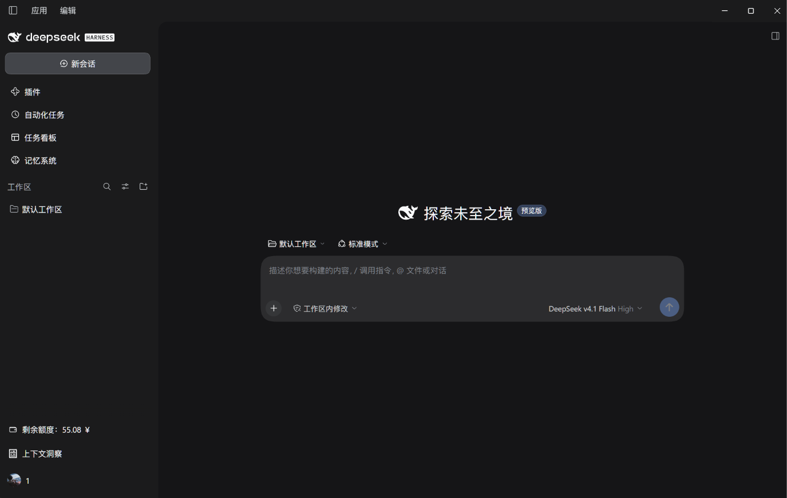
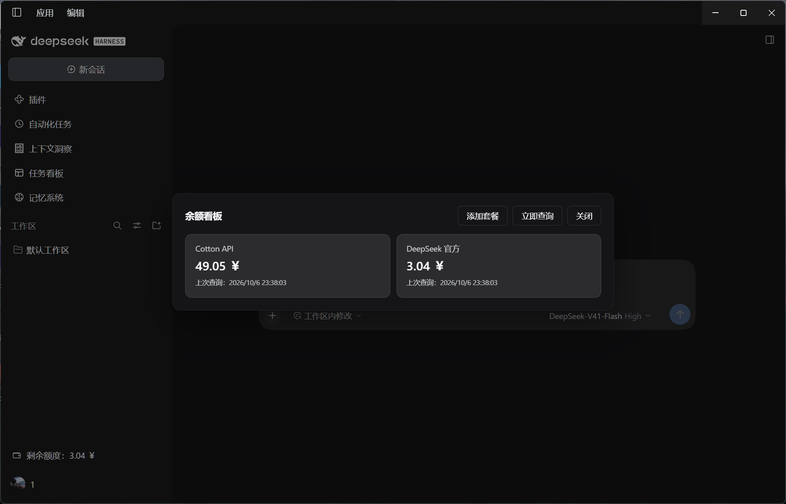
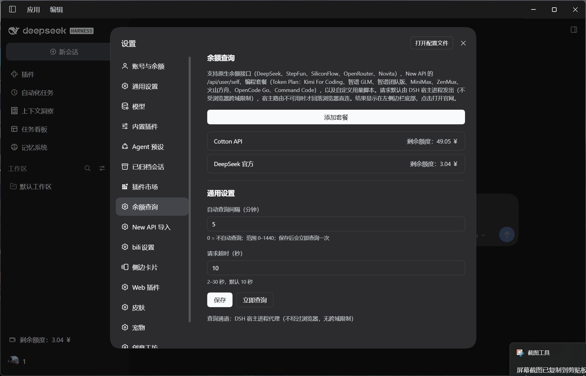

# dsh-balance-inquiry

[**English**](./README_en.md) ｜ 简体中文

已发布到 npm：[`dsh-balance-inquiry`](https://www.npmjs.com/package/dsh-balance-inquiry)
（`npm i dsh-balance-inquiry` / `pnpm add dsh-balance-inquiry`）。

在 DSH 左侧边栏底部、「上下文洞察」的**上面**加一行按钮：

```
💰 剩余额度：12.34 ￥
```






- **多套餐**：一个套餐一条配置，侧边栏显示所有套餐里最紧急的那条；**左键点这一行打开余额看板**，
  每个套餐一张圆角长方形卡片（套餐名称 / 剩余额度 / 上次查询时间）。
- 看板里：**左键点卡片打开这个套餐的官网地址**，另有「添加套餐」「立即查询」按钮，
  按 Esc 或点遮罩关闭；要看/改某个套餐就去 设置 → 余额查询 里点它的长条按钮。
- 设置页分两级：一级是「添加套餐」+ 已添加套餐的长条按钮列表 + 通用设置；点「添加套餐」弹窗先选
  **按量计费（API Key）**还是 **Token Plan / Coding Plan**，再选厂商；点长条按钮进入二级编辑页
  （改名称 / 厂商 / 令牌 / 接口地址 / 官网地址，或删除套餐）。
- 支持 New API（one-api / new-api 系）、DeepSeek 官方、StepFun、SiliconFlow（国内 / 国际）、
  OpenRouter、Novita AI 六类**原生余额接口**，以及**自定义用量脚本**
  （`({ request: {…}, extractor: function (response) {…} })`，支持
  `{{baseUrl}}` / `{{apiKey}}` / `{{accessToken}}` / `{{userId}}` 占位符）。
- 支持 **8 家编程套餐（Token Plan / Coding Plan）**的用量查询：Kimi For Coding、智谱 GLM、
  智谱 GLM 团队版、MiniMax、ZenMux、火山方舟（Agent / Coding Plan）、OpenCode Go、Command Code；
  显示每个时间窗口（5 小时 / 周 / 月）的**已用百分比与剩余百分比**，剩余不足 10% 时变黄。
- New API 默认 `GET {baseUrl}/api/user/self`，显示值 = `data.quota ÷ 换算比例`
  （默认 500000，也就是 1 ￥ = 500000 quota）；**按积分 / credits 计的套餐不显示换算比例**。
- **没有「自动识别」**：厂商由套餐显式指定，接口地址不再参与判断。
- **切换模型供应商自动联动**：套餐的「供应商ID」可绑定到 DSH 里任意可选的 provider：
  **官方登录 `deepseek-official`**、**账号登录 `deepseek-account`**，以及 `cordis.patch.yml`
  里 `llm-pi-ai` 配置的自定义路由（如 `cotton-api`）。
  当您在 DSH 中切换模型时，左下角自动感知并显示当前供应商对应套餐的余额；未匹配或未绑定时回退展示所有套餐中最紧急的一项。
- 多套餐 / 多币种支持：侧边栏默认显示额度最少（最紧急）或当前激活供应商的那一项，鼠标悬停的 tooltip 里列出所有套餐
  （含每个套餐的各档位名称与重置时间）。
- **keep-last-good**：瞬时失败（网络错误 / 超时 / 5xx / 429）时，10 分钟内继续展示上次成功的余额，
  tooltip 标注「上次成功：…」；鉴权失败等确定性失败立即透出并清掉旧值，避免显示过期额度。
- 余额只在**为 0** 时变红；只有按百分比的档位才做「剩余 < 10%」的黄色预警。
- 请求默认由 **DSH 宿主进程**发出，不受浏览器跨域限制；宿主通道不可用时自动回落浏览器直连。
- 安全边界：取消向宿主获取 `baseURL` 等敏感网络信息的行为；仅通过受约束的本机路由读取 provider id 用于匹配。

## 安装

```powershell
dsh plugin --profile desktop add dsh-balance-inquiry
```


> profile 的依赖列表和 bundles 是**启动时**读取的，所以装好后要重启 DSH 桌面端
> （Web 版则重启 `dsh web`）。重启后侧边栏底部就会多出这一行。

## 配置

打开 **设置 → 余额查询**（一级页）：

> 插件**不预设任何站点**：接口地址与官网地址都是空的，也不会自动去查任何第三方服务。
> 第一次使用请点「添加套餐」自己填；两个地址都为空时，看板卡片不会跳转。

| 字段 | 说明 |
| --- | --- |
| 套餐名称 | 看板卡片与侧边栏 tooltip 上显示的名字，留空则用厂商名 |
| 计费类型 | `按量计费（API Key）` 或 `Token Plan / Coding Plan`，决定可选的厂商与要填的字段 |
| 厂商 | 按量计费：New API / One API、DeepSeek、StepFun、SiliconFlow（国内 / 国际）、OpenRouter、Novita AI、自定义脚本；编程套餐：Kimi For Coding、智谱 GLM、智谱 GLM 团队版、MiniMax、ZenMux、火山方舟、OpenCode Go、Command Code |
| 接口地址 | 例如 `https://api.example.com`，末尾不要带 `/`；原生厂商用官方地址、不显示该字段 |
| 用量接口地址 | 编程套餐用；ZenMux 必填，火山方舟用来推断区域（形如 `https://ark.cn-beijing.volces.com/api/plan/v3`） |
| 访问令牌 / 控制台令牌 | New API 用控制台「系统访问令牌」（**不是** `sk-` 开头的 API Key），作为 `Authorization: Bearer …` 发送；官方厂商 / 编程套餐填对应平台的令牌 |
| 用户 ID | 作为 `New-Api-User` 请求头发送，部分站点必填 |
| 组织 ID / 项目 ID | 选「智谱 GLM 团队版」时出现，分别作为 `bigmodel-organization` / `bigmodel-project` 请求头发送 |
| AccessKey ID / SecretAccessKey | 选「火山方舟」时出现，用于 OpenAPI 签名（不是推理用的 API Key） |
| 官网地址 | 看板卡片左键打开的网址；留空则改用接口地址 |
| 供应商ID | 绑定当前套餐到 DSH 的某个 provider id（下拉里列出全部可选值）。官方登录是 `deepseek-official`（API Key）、账号登录是 `deepseek-account`，自定义供应商是 `cordis.patch.yml` 里 `llm-pi-ai` 路由的 id（如 `cotton-api`）。在 DSH 里切换到该供应商时，左下角自动显示这个套餐的余额；选「不设置」则始终按最紧急额度展示 |
| 额度换算比例 / 货币单位 | **只有 New API 与自定义脚本显示**；按积分 / credits 计的套餐不显示 |
| 自定义脚本 | 选「自定义脚本」时出现，旁边有「填入 New API 模板 / 通用模板」按钮 |
| 自动刷新间隔 | **分钟**，0 = 不自动查询；默认 5 分钟（通用设置） |
| 请求超时 | 秒，2–30，默认 10（通用设置） |

配置存在渲染进程的 `localStorage`：套餐列表在 `dsh-balance-inquiry:accounts`，
通用设置在 `dsh-balance-inquiry:settings`，每个套餐最近一次读数在 `dsh-balance-inquiry:results`，
所以重启后看板会立刻显示上次的余额，不用等第一次请求。

## 各供应商的端点

| 计费类型 / 厂商 | 端点 | 取值 |
| --- | --- | --- |
| 按量计费 · New API | `GET {baseUrl}/api/user/self` | `data.quota ÷ 换算比例` |
| DeepSeek | `GET https://api.deepseek.com/user/balance` | `balance_infos[].total_balance`（每个币种一条） |
| StepFun | `GET https://api.stepfun.com/v1/accounts` | `balance`（CNY） |
| SiliconFlow | `GET https://api.siliconflow.{cn,com}/v1/user/info` | `data.totalBalance` |
| OpenRouter | `GET https://openrouter.ai/api/v1/credits` | `total_credits - total_usage` |
| Novita AI | `GET https://api.novita.ai/v3/user/balance` | `availableBalance ÷ 10000`（USD） |

响应解析、错误文案（`Network error: …` / `Authentication failed (HTTP 401)` /
`Failed to parse response: …`）、脚本引擎的字段校验与 200 字符错误体预览，都由插件自己实现，
可以在「设置 → 余额查询」里看到每次查询的具体原因。

## 编程套餐（Token Plan / Coding Plan）

在「添加套餐」弹窗里选 `Token Plan / Coding Plan`，再选厂商（不再有自动识别）。
编程套餐没有"余额"这个概念，所以显示的是每个时间窗口的**用量百分比**：看板卡片取最紧急的一项
（已用最多 / 剩余最少），tooltip 与编辑页列出全部窗口。

| 厂商 | 端点 | 需要填写 |
| --- | --- | --- |
| Kimi For Coding | `GET https://api.kimi.com/coding/v1/usages` | 访问令牌 |
| 智谱 GLM | `GET {open.bigmodel.cn \| api.z.ai}/api/monitor/usage/quota/limit` | 访问令牌（按接口地址判断国内 / 国际站） |
| 智谱 GLM 团队版 | `GET https://open.bigmodel.cn/api/monitor/usage/quota/limit?type=2` | 访问令牌 + 组织 ID + 项目 ID（不参与自动识别，需手动选） |
| MiniMax | `GET {api.minimaxi.com \| api.minimax.io}/v1/api/openplatform/coding_plan/remains` | 访问令牌（按接口地址判断国内 / 国际站） |
| ZenMux | `GET {接口地址}/api/usage` | 访问令牌 + 接口地址（或用 ZenMux 的用量脚本地址） |
| 火山方舟（Agent / Coding Plan） | `POST https://open.volcengineapi.com/?Action=GetAFPUsage\|GetCodingPlanUsage&Version=2024-01-01` | AccessKey ID + SecretAccessKey（OpenAPI 签名，按接口地址推断区域） |
| OpenCode Go | `GET https://opencode.ai/zen/go/v1/usage` | 访问令牌 |
| Command Code | `GET https://api.commandcode.ai/alpha/...`（串行 4 次：whoami → credits → subscriptions → usage/summary） | 访问令牌 |

- 时间窗口统一归一为 **5 小时 / 周 / 月**：Kimi 的 `limits[]`（5 小时）与 `usage`（周），
  智谱的 `TOKENS_LIMIT` / `CREDIT_LIMIT`（按 `unit` 3 = 5 小时、6 = 周），MiniMax 的
  `model_remains[]`（`general` 模型的区间 / 周），ZenMux 的 `quota_5_hour` / `quota_7_day`，
  火山的 `AFPFiveHour` / `AFPWeekly` / `AFPMonthly` + `QuotaUsage[]`，OpenCode Go 的
  `rolling` / `weekly` / `monthly`，Command Code 的 `windowLimits` + 月度池。
- 火山方舟会先查 **Agent Plan**，没有活跃订阅时自动回落查 **Coding Plan**，
  两者都没有时才报「没有找到活跃订阅」。
- 所有编程套餐请求超时统一 15 秒；鉴权失败（401 / 403 / 签名错误）会把令牌标为失效，
  并在提示里带上服务端返回的原因。
- 有一项套餐同时返回美元金额时（ZenMux、Command Code），改用美元金额显示，而不是百分比。

## 自定义用量脚本

「厂商」选「自定义脚本」后，可以粘贴一段求值后返回对象的脚本，用来适配任何站点：

```js
({
  request: {
    url: "{{baseUrl}}/api/user/self",
    method: "GET",
    headers: { "Authorization": "Bearer {{accessToken}}", "New-Api-User": "{{userId}}" }
  },
  extractor: function (response) {
    return {
      planName: response.data.group || "默认套餐",
      remaining: response.data.quota / {{rate}},
      used: response.data.used_quota / {{rate}},
      total: (response.data.quota + response.data.used_quota) / {{rate}},
      unit: "CNY"
    };
  }
})
```

- 占位符：`{{baseUrl}}`、`{{apiKey}}` / `{{accessToken}}`（当前令牌）、`{{userId}}`、`{{rate}}`（换算比例）。
- `extractor` 可以返回**一项**或**一项数组**（多套餐 / 多币种），字段：
  `{ planName, remaining, used, total, unit, isValid, invalidMessage }`。
- 只允许 HTTPS（本机 `http://localhost` 除外）；脚本语法错误、`extractor` 抛错、返回数字等原始值，
  都会在设置页给出中文原因；`extractor` 返回 `isValid: false` 时按钮上显示为「无效」而不是硬错误。
- 旁边两个按钮可以一键填入 New API 模板 / 通用模板。

## 查询可能失败的原因

插件默认把请求交给**宿主进程**发出（Node，不受浏览器同源策略约束），但仍可能遇到这些情况：

| 现象 | 原因 | 处理 |
| --- | --- | --- |
| `网络错误 Network error: 无法连接 <host>` | 域名解析不了 / 网络不通；或请求走了浏览器直连通道，而目标站没返回 `Access-Control-Allow-Origin` | 完全退出并重开 DSH 让宿主通道生效；确认地址本身可用 |
| `请求超时 Request failed: timeout after Ns` | 目标站响应慢或不可达 | 把「请求超时」调大（2–30 秒） |
| `Authentication failed (HTTP 401)` / `无权进行此操作，access token 无效` | 令牌不对：New API 要的是控制台「系统访问令牌」，不是 chat 用的 API Key；有的站点还要「用户 ID」 | 重新复制令牌、补上用户 ID，点「立即查询」 |
| `Failed to parse response: 缺少字段 …` | 地址指向的不是该供应商的余额接口，或站点字段不同 | 把「厂商」改成「自定义脚本」，自己写取值规则 |
| 一直显示「上次成功」的旧余额 | 最近一次是瞬时失败，10 分钟内继续展示上次成功的值 | 看设置页状态行的原因，或点「立即查询」重试 |
| 设置页底部写「查询通道：浏览器直连」 | 宿主路由没生效（多半是没重启 DSH，或 webserver 被禁用） | 完全退出并重新打开 DSH |

宿主通道的原理：

```
渲染进程                                   宿主进程（Node，不受 CORS 限制）
  POST /plugins/dsh-balance-inquiry/proxy   ───────►  dsh-balance-inquiry/lib/index.js
  { url, method, headers, body,             │  fetch(url, …)
    timeoutSeconds }                        ▼
  ◄─────── { ok:true, status, body }     目标站点
  （同源请求，不经网络，也没有 CORS 问题）
```

- 路由由宿主半边的 `lib/index.js` 用 `dsh-host-webserver` 注册成 **exact 路由**
  `/plugins/dsh-balance-inquiry/proxy`（exact 表优先于 `dsh-client-modules` 的 `/plugins/<id>/` 前缀路由）。
- 桌面端里 `dsh-app://app/plugins/...` 会被 Electron 主进程的 `protocol.handle`
  **原样转发**给宿主 webserver（方法、自定义头、请求体都会保留，并注入会话 cookie），
  所以渲染进程只要用相对路径 fetch 即可；Web 版是普通的 http 同源请求。
- 路由只服务**带会话 cookie 的本机调用**，并拒绝：非 HTTPS 目标（本机 `http://localhost` 除外）、
  URL 里带用户名密码、内网 / 回环 IP。它不是开放代理。
- 请求头**原样转发**，所以浏览器禁止设置的头（`User-Agent` 等）写在自定义脚本里也能真的发出去。
- 宿主路由不存在时（旧宿主、webserver 被禁用），客户端**记住并回落浏览器直连**，
  功能不会因为宿主侧缺失而不可用。
- **设置 → 余额查询** 底部会显示当前用的通道：`查询通道：DSH 宿主进程代理（不经过浏览器，无跨域限制）`
  或 `查询通道：浏览器直连（目标站必须允许跨域，否则会被拦）`。

## 目录

```
dsh-balance-inquiry/
├── package.json        # dsh.bundle.patch + dsh.client.platform = web
├── cordis.patch.yml    # 插入 Loader 条目
├── CHANGELOG.md        # 中文更新日志
├── CHANGELOG_en.md     # 英文更新日志
├── docs/               # README 顶部的截图
├── icon.svg
├── LICENSE             # MIT
├── locale/{zh,en}.json # 文案（同一份也内联在 client.js 里）
├── README.md           # 中文说明
├── README_en.md        # 英文说明
├── NOTICE.md           # 许可证与版权说明
├── tools/              # 安装 / 自测脚本（不会随安装复制进 profile）
│   ├── install-balance-plugin.cjs      # 复制包目录 + 补 profile 清单
│   ├── register-profile-bundle.cjs     # 只把包名登记进 dsh.profile.bundles
│   ├── balance-smoke-test.cjs          # 客户端 bundle 自测
│   ├── balance-host-proxy-test.cjs     # 宿主代理自测
│   ├── verify-balance-install.cjs      # 装机校验（源目录 / 装机目录逐文件比对）
│   └── sync-balance-locale.cjs         # 把 client.js 里的文案同步到 locale/*.json
└── lib/
    ├── index.js        # 宿主半边：/plugins/dsh-balance-inquiry/proxy 代理路由（Node 侧发请求，无 CORS）
    ├── index.d.ts
    └── client.js       # 全部功能：侧边栏条目 + 设置页 + 查询引擎 + 代理优先 / 直连回落
```

版本变更见 [`CHANGELOG.md`](./CHANGELOG.md)（中文）· [`CHANGELOG_en.md`](./CHANGELOG_en.md)（English）。

